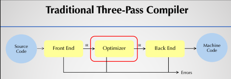
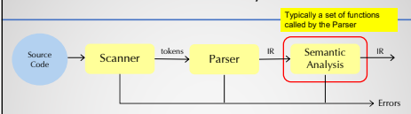
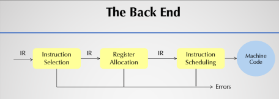
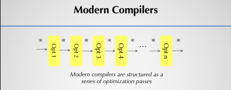
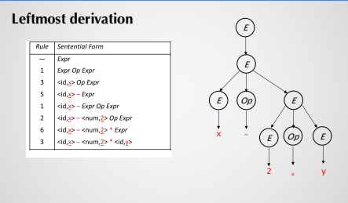
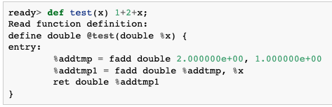
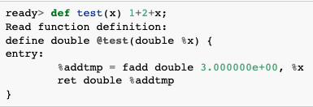
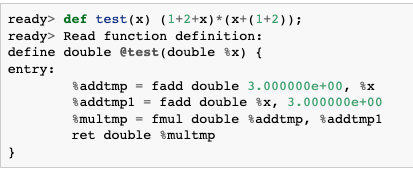
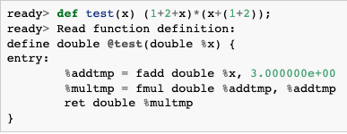

# LLVM Kaleidoscope Tutorial

Based on llvm [tutorial](https://llvm.org/docs/tutorial/MyFirstLanguageFrontend/index.html) on creating a compiler for the kaleidoscope  programming language. 

Influences
* https://github.com/ghaiklor/llvm-kaleidoscope
* https://llvm.org/docs/tutorial/MyFirstLanguageFrontend/index.html
* [CS 5331 - Crafting Compilers](https://cs.txstate.edu/academics/course_detail/CS/5331/)

---
## Kaleidoscope

* procedural language
* functions, conditionals, math, etc.
* Only 64-bit floating point type 

```python
# Compute the x'th fibonacci number.
def fib(x)
  if x < 3 then
    1
  else
    fib(x-1)+fib(x-2)

# This expression will compute the 40th number.
fib(40)
```
---
## Compiler


* three pass compiler

### Front-End



* maps source code to IR
* scanner(lexer) "scans" code and converts it into tokens
* parser takes in tokens and performs semantic action
    * check for validity (number of parameters, valid declarations, etc.)
* Information is added to symbol table

### Back-End


* choose instructions for each IR operation
* which values to keep in registers
* translate IR into machine code

### Modern Compilers


* optimization passes at different steps
---
## Lexer (Chapter 1)
[link](https://llvm.org/docs/tutorial/MyFirstLanguageFrontend/LangImpl01.html)

* perform lexical analysis, read and break into tokens

---
## Parser and AST (Chapter 2)
[link](https://llvm.org/docs/tutorial/MyFirstLanguageFrontend/LangImpl02.html)

* convert tokens into IR
* detect errors
* defines a grammar for sentence detection and derivation

### Parse Tree (Abstract Syntax Tree)
* Use grammar to derive valid strings in a language by derivation
* each object represents a single construct in the language (expression, function)




* expressions classes used in code to identify variable names, binary operators, function calls, etc.

### Parser

* Define how to read tokens from scanner and build AST
* helper functions that parses each of the previously mentioned expressions
```cpp
/// numberexpr ::= number
static std::unique_ptr<ExprAST> ParseNumberExpr() {
  auto Result = std::make_unique<NumberExprAST>(NumVal);
  getNextToken(); // consume the number
  return std::move(Result);
}
```
* usually perform calls recursively
* Main Loop used for code
```cpp
static void MainLoop() {
  while (true) {
    fprintf(stderr, "ready> ");
    switch (CurTok) {
    case tok_eof:
      return;
    case ';': // ignore top-level semicolons.
      getNextToken();
      break;
    case tok_def:
      HandleDefinition();
      break;
    case tok_extern:
      HandleExtern();
      break;
    default:
      HandleTopLevelExpression();
      break;
    }
  }
}
```

```cpp
//===----------------------------------------------------------------------===//
// Main driver code.
//===----------------------------------------------------------------------===//

int main() {
  // Install standard binary operators.
  // 1 is lowest precedence.
  BinopPrecedence['<'] = 10;
  BinopPrecedence['+'] = 20;
  BinopPrecedence['-'] = 20;
  BinopPrecedence['*'] = 40; // highest.

  // Prime the first token.
  fprintf(stderr, "ready> ");
  getNextToken();

  // Run the main "interpreter loop" now.
  MainLoop();

  return 0;
}
```

---
## AST -> LLVM IR (Chapter 3)
[link](https://llvm.org/docs/tutorial/MyFirstLanguageFrontend/LangImpl03.html)

---
## JIT and Optimizer support (Chapter 4)
[link](https://llvm.org/docs/tutorial/MyFirstLanguageFrontend/LangImpl04.html)

Adding optimization support for kaleidoscope and adding JIT compilation support

### Constant Folding

* evaluating constant operands at compile time to improve runtime performance

Example: without constant folding  


Example: with constant folding  


* normally support in AST
* With LLVM since all calls go through LLVM IR Builder, the builder itself checks where folding is possible
* recommend using `IRBuilder` for generating code for this, as no "syntatic overhead" 
* However, this isn't without its limitations

What is the output of the defined function using the chapter3 code?
```cpp
def test(x) (1+2+x)*(x+(1+2));
```



* instead of separating we like to see something like 

```cpp
“tmp = x+3; 
result = tmp*tmp;”
```

* problem is no amount of local analysis can detect this
* However, this can be solved with an optimization "pass"

### Optimization Passes

* LLVM offers multiple options for optimization passes
* Built on the notion that one set of optimizations is not right for all languages and situations


Two sets of passes for support in LLVM
* `whole module`
    * across large body of code, often whole file
* `per function`
    * operate on a single function at a time
* [ How to Write a Pass ](https://llvm.org/docs/WritingAnLLVMPass.html)  
* [ List of LLVM Passes ](https://llvm.org/docs/Passes.html)  

What we want is a per-function optimization as a user types in their functions
* `FunctionPassManager` used to keep track of which LLVM optimizations we like to run
    * new Manager for each module we want to optimize
    * Create a `FunctionPassManager` function to create and initialize the module and pass manager for us

```cpp
  void InitializeModuleAndPassManager(void) {
  // Open a new module.
  TheModule = std::make_unique<Module>("my cool jit", TheContext);

  // Create a new pass manager attached to it.
  TheFPM = std::make_unique<legacy::FunctionPassManager>(TheModule.get());

  // Do simple "peephole" optimizations and bit-twiddling optzns.
  TheFPM->add(createInstructionCombiningPass());
  // Reassociate expressions.
  TheFPM->add(createReassociatePass());
  // Eliminate Common SubExpressions.
  TheFPM->add(createGVNPass());
  // Simplify the control flow graph (deleting unreachable blocks, etc).
  TheFPM->add(createCFGSimplificationPass());

  TheFPM->doInitialization();
  }
  ```

* add call adds four optimization passes (look at tutorial for more details) but mostly related to "cleanup" optimizations
* Run our new optimizer after our newly created function is constructed but before it's returned to the client

```cpp
if (Value *RetVal = Body->codegen()) {
  // Finish off the function.
  Builder.CreateRet(RetVal);

  // Validate the generated code, checking for consistency.
  verifyFunction(*TheFunction);

  // Optimize the function.
  TheFPM->run(*TheFunction);

  return TheFunction;
}
```

* From this you can see that `FunctionPassManager` optimizes and updated the LLVM Function* in place

Going back to our previous example lets now try our code again




* You can view a list of various passes available in LLVM [here](https://llvm.org/docs/Passes.html). 

Now that we have our code coming out of our front-end lets execute it!

### Adding a JIT Compiler

* LLVM IR code can be used to run optimizations (as above), dump to text or binary forms, compily it to assembly files (.s), or <ins>JIT compile</ins> it
* We'll add JIT compiler support by immediately evaluating the top-level expressions typed in   
* Examples
    * if a user types `1+2` then it should print out 3
    * if a user defines a function, we should be able to call it from the command line  

1.  create code for current native target and declare and initialize the JIT
    * Calling some `InitializeNativeTarget\*` functions and adding global variable `TheJIT`

    ```cpp
    static std::unique_ptr<KaleidoscopeJIT> TheJIT;
    ...
    int main() {
      InitializeNativeTarget();
      InitializeNativeTargetAsmPrinter();
      InitializeNativeTargetAsmParser();

      // Install standard binary operators.
      // 1 is lowest precedence.
      BinopPrecedence['<'] = 10;
      BinopPrecedence['+'] = 20;
      BinopPrecedence['-'] = 20;
      BinopPrecedence['*'] = 40; // highest.

      // Prime the first token.
      fprintf(stderr, "ready> ");
      getNextToken();

      TheJIT = std::make_unique<KaleidoscopeJIT>();

      // Run the main "interpreter loop" now.
      MainLoop();

      return 0;
    }
    ```
2. setup data layout for JIT
  
    ```cpp
    void InitializeModuleAndPassManager(void) {
      // Open a new module.
      TheModule = std::make_unique<Module>("my cool jit", TheContext);
      TheModule->setDataLayout(TheJIT->getTargetMachine().createDataLayout());

      // Create a new pass manager attached to it.
      TheFPM = std::make_unique<legacy::FunctionPassManager>(TheModule.get());
    ...
    ```
3. KaleidoscopeJIT class is a simple JIT available through LLVM
    * learn more at the source code [here](include/KaleidoscopeJIT.h)
    * For now take it as is but will extend in later tutorials
4. Use API to add a module to JIT
    * `addModule` - add LLVM IR module to JIT
    * `removeModule` - removes module, freeing memory 
    * `findSymbol` - allows us to look at pointers to compiled code 
5. Use this API to parse top-level expressions
    ```cpp
    static void HandleTopLevelExpression() {
      // Evaluate a top-level expression into an anonymous function.
      if (auto FnAST = ParseTopLevelExpr()) {
        if (FnAST->codegen()) {

          // JIT the module containing the anonymous expression, keeping a handle so
          // we can free it later.
          auto H = TheJIT->addModule(std::move(TheModule));
          InitializeModuleAndPassManager();

          // Search the JIT for the __anon_expr symbol.
          auto ExprSymbol = TheJIT->findSymbol("__anon_expr");
          assert(ExprSymbol && "Function not found");

          // Get the symbol's address and cast it to the right type (takes no
          // arguments, returns a double) so we can call it as a native function.
          double (*FP)() = (double (*)())(intptr_t)ExprSymbol.getAddress();
          fprintf(stderr, "Evaluated to %f\n", FP());

          // Delete the anonymous expression module from the JIT.
          TheJIT->removeModule(H);
        }
    ```
    * Once complete we can add the module to the JIT using `addModule`
    * once added we need a pointer to the final generated code using `findSymbol` and pass in the name of the top level function: `__anon_expr` 
    * We then get the memory address of the `__anon_expr` function using `getAddress()`
        * Since the LLVM JIT compiler matches the native platform ABI, we can just cast the result pointer to a function pointer of that type and call it directly
        * This means there is no difference between the JIT compiled code and native machine code that is statically linked in our application
    * Once finished, since we don't support re-evaluation of top-level expressions, we move the module from the JIT when we are done

Try it out now!

`ready> 4+5;`  
`ready> def testfunc(x y) x + y*2;`  
`ready> testfunc(4, 10);`

But if we try using it again????
```cpp
ready> testfunc(5, 10);
ready> LLVM ERROR: Program used external function 'testfunc' which could not be resolved!
```

WHY??  
`testfunc was a part of the same module that contained the anonymous expression. When we removed the module from the JIT we also deleted the definition to testfunc along with it.` 

Solution: Putting the anonymous expression in a separate module from the rest of the function definitions. This means we can delete it without affecting the rest of the functions.

Currently `KaleidoscopeJIT` always returns the most recent definition
```cpp
ready> def foo(x) x + 1;
Read function definition:
define double @foo(double %x) {
entry:
  %addtmp = fadd double %x, 1.000000e+00
  ret double %addtmp
}

ready> foo(2);
Evaluated to 3.000000

ready> def foo(x) x + 2;
define double @foo(double %x) {
entry:
  %addtmp = fadd double %x, 2.000000e+00
  ret double %addtmp
}

ready> foo(2);
Evaluated to 4.000000
```

Let's re-generate previous function definitions into each new module we open.

```cpp
static std::unique_ptr<KaleidoscopeJIT> TheJIT;

...

Function *getFunction(std::string Name) {
  // First, see if the function has already been added to the current module.
  if (auto *F = TheModule->getFunction(Name))
    return F;

  // If not, check whether we can codegen the declaration from some existing
  // prototype.
  auto FI = FunctionProtos.find(Name);
  if (FI != FunctionProtos.end())
    return FI->second->codegen();

  // If no existing prototype exists, return null.
  return nullptr;
}

...

Value *CallExprAST::codegen() {
  // Look up the name in the global module table.
  Function *CalleeF = getFunction(Callee);

...

Function *FunctionAST::codegen() {
  // Transfer ownership of the prototype to the FunctionProtos map, but keep a
  // reference to it for use below.
  auto &P = *Proto;
  FunctionProtos[Proto->getName()] = std::move(Proto);
  Function *TheFunction = getFunction(P.getName());
  if (!TheFunction)
    return nullptr;
```

* new global `FunctonProtos` holds most recent prototype for each function
* `getFunction` - searches `TheModule` for an existing function declaration, creating anew one if it is not found
* Need to update `CallExprAST::codegen()` by calling `TheModule->getFunction()` 
* update `FunctionAST::codegen()` to update the FunctionProtos map first, then call `getFunction()`. This is useful becuase we can now always obtain a function declaration in the current module for any previously declared function. 

We now need to update _HandleDefinition_ and _HandleExtern_ which are called during parsing of the tokens

```cpp
static void HandleDefinition() {
  if (auto FnAST = ParseDefinition()) {
    if (auto *FnIR = FnAST->codegen()) {
      fprintf(stderr, "Read function definition:");
      FnIR->print(errs());
      fprintf(stderr, "\n");
      TheJIT->addModule(std::move(TheModule));
      InitializeModuleAndPassManager();
    }
  } else {
    // Skip token for error recovery.
     getNextToken();
  }
}

static void HandleExtern() {
  if (auto ProtoAST = ParseExtern()) {
    if (auto *FnIR = ProtoAST->codegen()) {
      fprintf(stderr, "Read extern: ");
      FnIR->print(errs());
      fprintf(stderr, "\n");
      FunctionProtos[ProtoAST->getName()] = std::move(ProtoAST);
    }
  } else {
    // Skip token for error recovery.
    getNextToken();
  }
}
```

* `HandleDefinition` - add two lines to transfer the newly defined function to the JIT and open a new module
* `HandleExtern` - add one line to add the prototype to _FunctionProtos_

Try it Out!

```shell
ready> extern sin(x);  
ready> extern cos(x);  
ready> sin(1.0);
ready> def foo(x) sin(x)*sin(x) + cos(x)*cos(x);
ready> foo(4.0);
```

How does the JIT compiler know about sin and cos?  
`It first searches all the modules added to the JIT, and if no definition is found falls back to calling 'dlsym("sin")' and calls the c math library version of sin directly.`