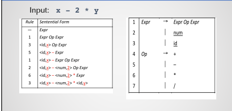

# LLVM Kaleidoscope Tutorial

Based on llvm [tutorial](https://llvm.org/docs/tutorial/MyFirstLanguageFrontend/index.html) on creating a compiler for the kaleidoscope  programming language. 

Influences
* https://github.com/ghaiklor/llvm-kaleidoscope
* https://llvm.org/docs/tutorial/MyFirstLanguageFrontend/index.html
* [CS 5331 - Crafting Compilers](https://cs.txstate.edu/academics/course_detail/CS/5331/)

---
## Kaleidoscope

* procedural language
* functions, conditionals, math, etc.
* Only 64-bit floating point type 

```python
# Compute the x'th fibonacci number.
def fib(x)
  if x < 3 then
    1
  else
    fib(x-1)+fib(x-2)

# This expression will compute the 40th number.
fib(40)
```
---
## Compiler


* three pass compiler

### Front-End


* maps source code to IR
* scanner(lexer) "scans" code and converts it into tokens
* parser takes in tokens and performs semantic action
    * check for validity (number of parameters, valid declarations, etc.)
* Information is added to symbol table

### Back-End


* choose instructions for each IR operation
* which values to keep in registers
* translate IR into machine code

### Modern Compilers


* optimization passes at different steps
---
## Lexer (Chapter 1)
[link](https://llvm.org/docs/tutorial/MyFirstLanguageFrontend/LangImpl01.html)

* perform lexical analysis, read and break into tokens

---
## Parser and AST (Chapter 2)
[link](https://llvm.org/docs/tutorial/MyFirstLanguageFrontend/LangImpl02.html)

* convert tokens into IR
* detect errors
* defines a grammar for sentence detection and derivation

### Parse Tree (Abstract Syntax Tree)
* Use grammar to derive valid strings in a language by derivation
* each object represents a single construct in the language (expression, function)




* expressions classes used in code to identify variable names, binary operators, function calls, etc.

### Parser

* Define how to read tokens from scanner and build AST
* helper functions that parses each of the previously mentioned expressions
```cpp
/// numberexpr ::= number
static std::unique_ptr<ExprAST> ParseNumberExpr() {
  auto Result = std::make_unique<NumberExprAST>(NumVal);
  getNextToken(); // consume the number
  return std::move(Result);
}
```
* usually perform calls recursively
* Main Loop used for code
```cpp
static void MainLoop() {
  while (true) {
    fprintf(stderr, "ready> ");
    switch (CurTok) {
    case tok_eof:
      return;
    case ';': // ignore top-level semicolons.
      getNextToken();
      break;
    case tok_def:
      HandleDefinition();
      break;
    case tok_extern:
      HandleExtern();
      break;
    default:
      HandleTopLevelExpression();
      break;
    }
  }
}
```

```cpp
//===----------------------------------------------------------------------===//
// Main driver code.
//===----------------------------------------------------------------------===//

int main() {
  // Install standard binary operators.
  // 1 is lowest precedence.
  BinopPrecedence['<'] = 10;
  BinopPrecedence['+'] = 20;
  BinopPrecedence['-'] = 20;
  BinopPrecedence['*'] = 40; // highest.

  // Prime the first token.
  fprintf(stderr, "ready> ");
  getNextToken();

  // Run the main "interpreter loop" now.
  MainLoop();

  return 0;
}
```

---
## AST -> LLVM IR (Chapter 3)
[link](https://llvm.org/docs/tutorial/MyFirstLanguageFrontend/LangImpl03.html)

---
## JIT and Optimizer support (Chapter 4)
[link](https://llvm.org/docs/tutorial/MyFirstLanguageFrontend/LangImpl04.html)
